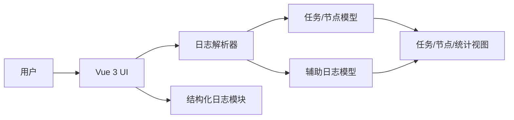

# MaaLogs

MaaLogs 是一个基于 Tauri + Vue 3 的桌面日志分析工具，用于解析 Maa 日志并以任务、节点、搜索与统计视图展示结果。

## 项目简介

MaaLogs 面向 Maa 生态日志排查场景，支持解析 `maa.log` 与 `go-service.log`，并在前端建立“任务 - 节点 - 辅助日志”的统一视图，帮助快速定位任务异常与识别偏差。

## 功能特性

- 任务分析：解析任务与节点时间线，展示节点详情与耗时
- 辅助日志关联：关联 go-service 日志与任务/节点上下文
- 文本搜索：支持大小写与正则搜索，跨文件高亮结果
- 节点统计：按节点维度统计次数、成功率与耗时
- 桌面体验：支持拖拽导入日志文件
- 结构化日志：统一日志格式，支持等级、归档与清理

## 系统架构图



## 架构说明

- 解析模块：将 `maa.log` 和 `go-service.log` 解析为统一结构
- 关联模块：通过时间窗、ID、业务标识对齐辅助日志
- 视图层：任务、节点、搜索、统计四大视图
- 日志模块：统一日志等级、上下文与归档逻辑

## 适用日志

- `.log`、`.json` 文件
- 必需文件名：`maa.log`、`go-service.log`
- 允许 `.zip` 包内包含上述文件

## 环境要求

- Node.js >= 18
- npm >= 9
- Rust 与 Tauri 环境（仅桌面版开发或构建需要）

## 安装与部署指南

### 依赖安装

```bash
npm install
```

### 前端开发

```bash
npm run dev
```

### 前端构建

```bash
npm run build
```

### Tauri 开发

```bash
npm run tauri dev
```

### Tauri 构建

```bash
npm run tauri build
```

### 配置说明

- Tauri 配置入口：`src-tauri/tauri.conf.json`
- 解析逻辑入口：`src/App.vue`
- 日志模块入口：`src/utils/logger.ts`

## 使用流程

1. 拖拽 `.log`/`.json`/`.zip` 文件到窗口，或点击选择文件
2. 点击“开始解析”
3. 切换顶部视图查看分析结果

## 使用示例

- 解析日志：拖拽 `maa.log` 与 `go-service.log`，点击“开始解析”
- 搜索异常：输入 `Tasker.Task.Failed` 并启用大小写匹配
- 正则定位：启用正则，输入 `Node\\.(Recognition|Action)Node\\.(Failed)` 过滤失败节点

## 最佳实践

- 同时加载 `maa.log` 与 `go-service.log` 提升关联准确性
- 对大日志优先使用拖拽方式，避免浏览器限制
- 正则搜索时加上范围词，提高定位效率

## API 文档（供二次开发）

### 解析模块

| 接口 | 说明 | 入参 | 出参 |
| --- | --- | --- | --- |
| parseLine | 解析 maa.log 单行 | `line: string`, `lineNum: number` | `LogLine \| null` |
| parseGoServiceLogLine | 解析 go-service JSON 行 | `line: string`, `lineNum: number`, `fileName: string` | `AuxLogEntry \| null` |
| buildTasks | 生成任务列表 | `events: EventNotification[]`, `stringPool: StringPool` | `TaskInfo[]` |
| correlateAuxLogs | 关联辅助日志 | `auxEntries: AuxLogEntry[]`, `tasks: TaskInfo[]` | `AuxLogEntry[]` |

### 日志模块

| 接口 | 说明 | 入参 | 出参 |
| --- | --- | --- | --- |
| createLogger | 创建模块日志器 | `module: string` | `{ debug/info/warn/error/fatal }` |
| setLoggerContext | 更新上下文 | `userId?: string`, `threadId?: string` | `void` |
| flushLogs | 立即刷盘 | 无 | `void` |

### 数据结构（简要）

- TaskInfo：任务 ID、入口、开始/结束时间、节点列表、进程/线程信息
- NodeInfo：节点 ID、名称、状态、时间戳、识别/动作详情
- AuxLogEntry：时间戳、等级、消息、任务/节点关联结果

## 错误码定义

> 当前前端直接展示提示语，以下错误码用于排障归档与后续扩展。

| 错误码 | 场景 | 对应提示 |
| --- | --- | --- |
| ERR_NO_FILES | 未选择解析文件 | 请先选择日志/配置文件 |
| ERR_INVALID_REGEX | 正则表达式非法 | 正则表达式无效 |
| ERR_PARSE_FAILED | 解析失败 | 解析失败，请检查日志内容 |
| ERR_NO_LOG_FOUND | 未发现日志 | 未发现 maa.log / go-service.log |

## 测试方法

- 构建校验：`npm run build`（包含 TypeScript 类型检查）
- 桌面调试：`npm run tauri dev`
- 手动回归：拖拽示例日志，验证任务、节点、搜索与统计视图

## 性能指标与策略

- 指标口径：解析吞吐量（行/秒）、内存峰值、搜索延迟
- 优化策略：分块解析（默认 1000 行/批）、字符串池复用、虚拟滚动
- 日志控制：结构化日志缓冲写入，支持归档与清理

## 已知问题

- 仅支持指定文件名的日志文件（`maa.log`、`go-service.log`）
- 超大日志解析时间随文件大小增长，建议分批分析

## 目录结构

- src/App.vue：核心解析逻辑与 UI
- src/utils/logger.ts：结构化日志模块
- src-tauri/：Tauri 配置与入口
- public/：前端静态资源

## 贡献指南

1. Fork 本仓库并创建分支
2. 提交功能变更与说明
3. 发起 Pull Request 并补充测试说明

## 联系方式

- 建议通过仓库 Issue / Pull Request 交流问题与需求
