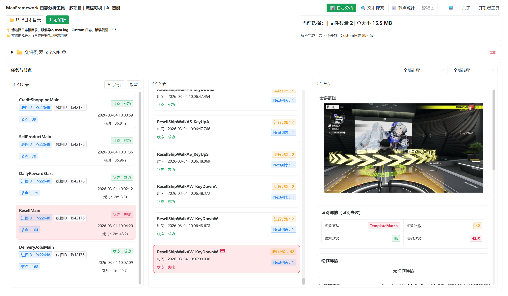
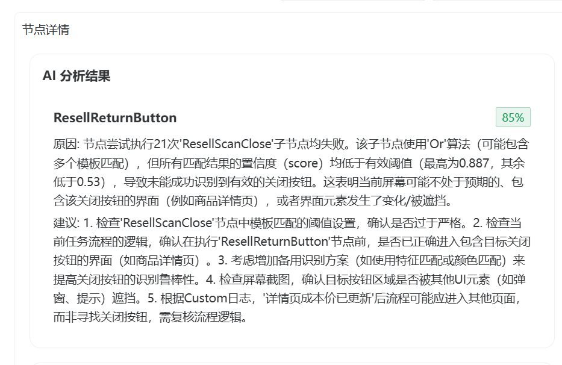
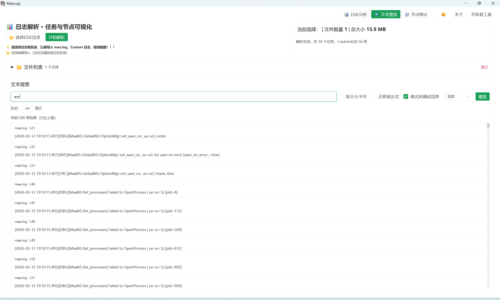
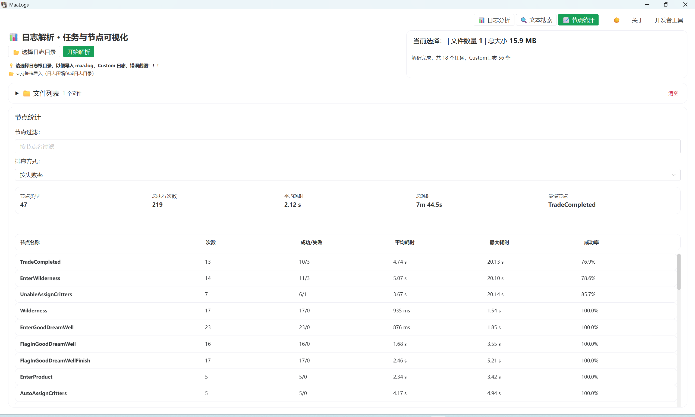

<!-- markdownlint-disable MD033 MD041 -->
<p align="center">
  
</p>

<div align="center">

# MaaLogs

⭐ MaaFramework 日志分析工具 - 多项目 | 流程可视 | AI 智能

</div>

<p align="center">
  <a href="https://vuejs.org/" target="_blank"></a>
  <a href="https://www.typescriptlang.org/" target="_blank"></a>
  <a href="https://www.naiveui.com/" target="_blank"></a>
  <a href="https://tauri.app/" target="_blank"></a>
  <a href="https://github.com/amiliyaai/MaaLogs/blob/main/LICENSE" target="_blank"></a>
  <a href="https://github.com/amiliyaai/MaaLogs/commits/main" target="_blank"></a>
  <a href="https://github.com/amiliyaai/MaaLogs/stargazers" target="_blank"></a>
</p>

<div align="center">

[📥 下载安装](#-下载安装) · [📖 使用文档](#-使用方法) · [🔧 开发指南](#-开发指南)

</div>

---

## ✨ 功能特性

| 功能                   | 描述                                                  |
| :--------------------- | :---------------------------------------------------- |
| 📊 **多项目日志解析**  | 支持 MaaEnd、M9A 等多种项目的custom日志格式，统一分析 |
| 🔄 **实时监控**        | 开启后自动检测日志目录中的新任务，无需手动刷新         |
| 🌲 **任务流程可视化**  | 树形图展示任务执行全过程，节点状态一目了然            |
| 🔄 **任务对比分析**    | 对比两次运行差异，识别失败节点、耗时异常、路径分歧    |
| 🔍 **页面内搜索**      | 支持任务、节点、识别、动作的搜索，模糊匹配，高亮跳转  |
| 🔍 **全文精准搜索**    | 支持正则表达式，快速定位关键日志                      |
| 📈 **节点统计分析**    | 执行次数、耗时分布、成功率一手掌握                    |
| 🤖 **AI 智能分析**     | 自动诊断失败原因，提供修复建议                        |
| 📸 **错误截图关联**    | 失败节点自动关联 on_error 截图，快速定位问题          |
| 🔗 **Custom 日志关联** | 自动关联业务日志与任务，完整还原执行场景              |
| 🔗 **Vision 截图关联** | 自动关联调试图像与节点，完整还原执行场景              |
| 🌐 **Web 运行模式**    | 支持纯浏览器运行，自动降级桌面专属能力                |

---

## 💡 为什么选择 MaaLogs

- 🚀 **一键解析**：选择目录即可分析，无需复杂配置
- 🎯 **精准定位**：失败节点 + 截图 + 日志三位一体
- 💡 **AI 助手**：不懂日志？AI 帮你分析原因
- 🔧 **可扩展**：支持自定义项目解析器
- 🖥️ **桌面应用**：本地运行，数据安全

---

## 📥 下载安装
前往 [Releases](https://github.com/amiliyaai/MaaLogs/releases/latest) 页面下载对应平台的安装包：
---
非开发人员请不要下载预发布版本，一般来说bug非常多
| 平台                    | 文件                              | 说明                         |
| :---------------------- | :-------------------------------- | :--------------------------- |
| **Windows x64**         | `MaaLogs-win-x86_64-*-setup.exe`  | Intel/AMD 64位处理器         |
| **Windows ARM64**       | `MaaLogs-win-aarch64-*-setup.exe` | ARM 处理器（如骁龙 X Elite） |
| **macOS Intel**         | `MaaLogs-macos-x86_64-*.dmg`      | Intel 芯片 Mac               |
| **macOS Apple Silicon** | `MaaLogs-macos-aarch64-*.dmg`     | M1/M2/M3 芯片 Mac            |
| **Linux x64**           | `MaaLogs-linux-x86_64-*.AppImage` | 通用 Linux 安装包            |

---

## 📖 使用方法

### 日志分析

1. 选择日志根目录（支持拖拽目录或压缩包）
2. 点击"开始解析"
3. 查看任务列表和节点详情

### 实时监控（仅桌面端）

> ⚠️ 该功能仅在 Tauri 桌面端可用，Web 端不支持

1. 选择日志目录并解析完成后
2. 在顶部点击"实时监控"开关开启
3. 开启后会自动检测日志目录中的新任务
4. 新任务会自动添加到任务列表

### 页面内搜索

1. 在顶部搜索框输入关键词
2. 支持搜索任务 ID、节点名称、识别名称、动作名称等
3. 支持模糊搜索，数字字段支持部分匹配
4. 点击搜索结果自动跳转到对应位置并高亮显示
5. 搜索结果自动滚动到视图中心位置

### AI 智能分析

1. 点击 "设置" 按钮配置 AI 服务商和模型
2. 输入对应服务商的 API Key
3. 选择一个任务
4. 点击"AI 分析"按钮
5. 在节点详情中查看分析结果

### 任务对比分析

1. 在任务列表中选择两个任务（基准任务和本次任务）
2. 点击"任务对比"按钮
3. 查看差异摘要，包括：
   - 概览信息：节点数量、耗时变化
   - 失败节点：新增失败、持续失败、已修复
   - 耗时异常：耗时显著变化的节点
   - 路径分歧：走了不同分支的节点
   - 识别变化：识别算法改变
   - 动作变化：动作类型改变
4. 在路线图中查看节点对齐情况
5. 点击节点查看详细差异

---

## 🖥️ 界面预览

|             日志分析              |          AI 智能分析           |
| :-------------------------------: | :----------------------------: |
|  |  |

|              文本搜索               |             统计分析              |
| :---------------------------------: | :-------------------------------: |
|  |  |

---

## 🛠️ Custom 日志项目支持

| 项目 | 状态 | 说明 |
| :--: | :--: | :-- |
|  MaaEnd | ✅ | 明日方舟：终末地 |
|  M9A | ✅ | 重返未来：1999 |

如需支持新的项目请提 issue 或者提交 PR

---

## 📁 项目结构

```
MaaLogs/
├── src/                      # 前端源码
│   ├── components/           # Vue 组件
│   ├── composables/          # Vue Composables
│   ├── parsers/              # 日志解析器
│   ├── types/                # TypeScript 类型
│   ├── utils/                # 工具函数
│   └── config/               # 应用配置
├── src-tauri/                # Tauri 后端
│   ├── src/                  # Rust 源码
│   └── icons/                # 应用图标
├── vscode/                   # VSCode 插件
└── docs/                     # 文档
```

---

## 🚀 快速开始

### 环境要求

- Node.js >= 18
- Rust >= 1.70

### 安装与运行

```bash
# 安装依赖
npm install

# Web 开发模式
npm run dev

# 桌面开发模式
npm run tauri:dev

# 构建发布
npm run tauri:build
```

## 🔧 开发指南

详细开发指南请参考 [AGENTS.md](AGENTS.md) 和 [项目开发指南](docs/developers/development-guide.md)。

---

## 🙏 致谢

### 开源框架

- [Vue](https://vuejs.org/) - 渐进式 JavaScript 框架
- [Naive UI](https://www.naiveui.com/) - Vue 3 组件库
- [Tauri](https://tauri.app/) - 跨平台桌面应用框架

### 参考项目

- [MaaFramework](https://github.com/MaaXYZ/MaaFramework) - 自动化框架
- [MaaEnd](https://github.com/MaaEnd/MaaEnd) - 《明日方舟：终末地》游戏小助手
- [M9A](https://github.com/MAA1999/M9A) - 重返未来：1999 小助手
- [MaaLogAnalyzer](https://github.com/MaaXYZ/MaaLogAnalyzer) - MaaFramework 应用可视化用户日志分析工具
  **UI设计参考，未使用其源代码**

---

## 📝 许可证

[MIT License](LICENSE)
