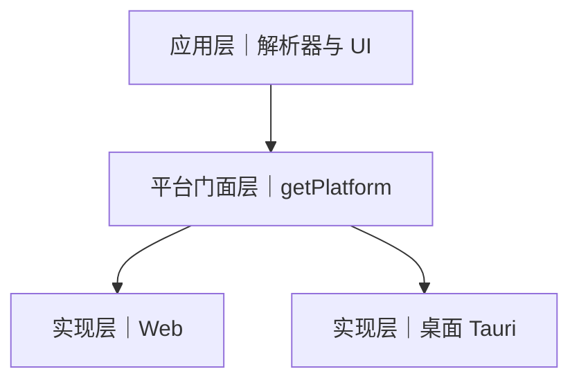
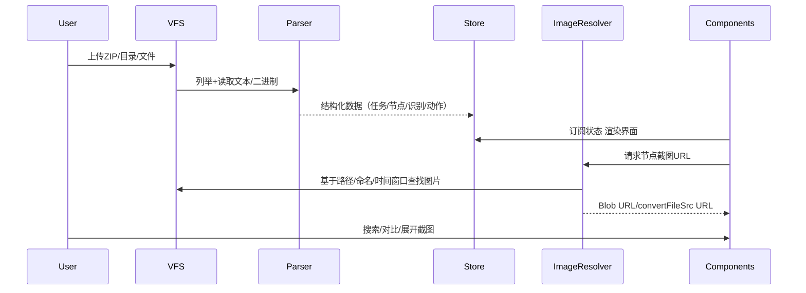

版本：v1.1（草案）
状态：待评审
作者：MaaLogs 
目标版本：Web 运行适配方案（不改既有桌面端能力）
更新日期：2026-03-08

**1. 项目背景与目标**
- 背景
  - MaaLogs 现为 Tauri + Vue 3 桌面应用，直接访问本地文件系统、窗口与更新能力。
  - 需求提出：支持纯 Web 环境运行，用户在浏览器中上传日志与截图包即可完成分析。
- 业务目标
  - 为非技术用户提供"零安装、开即用"的在线分析体验。
  - 保持与桌面端一致的解析与可视化能力，包括搜索、高亮、对比与截图查看。
- 技术目标
  - 在 Web 端移除对 @tauri-apps/* 的静态依赖，采用"运行时动态导入+能力降级"架构。
  - 引入"虚拟文件系统（VFS）"统一文件输入；兼容 ZIP、目录上传、多文件拖拽。
  - Web 端持久化采用 localStorage/IndexedDB；日志采用内存 ring buffer 与导出。
- 项目范围
  - 在不改动核心解析算法与 UI 交互的前提下，改造外围能力（文件、图片、存储、更新、窗口）。
  - 桌面端完全保留；构建与脚本不拆分，采用同仓双端构建。
- 边界条件
  - Web 端无法读取任意本机路径；必须由用户提供数据。
  - 不引入后端服务，部署为纯静态站点；可选上报与错误收集可作为后续增强。
- KPI 与验收标准
  - 兼容性：Web 环境（Chromium/Firefox/Safari 最新2大版本）均可完成"上传→解析→展示"全流程。
  - 正确性：核心任务解析一致性≥99%；对比差异结果与桌面端一致。
  - 性能：
    - 解析速率≥2MB/s（浏览器主流设备，10–100MB 日志包）；
    - 首次渲染时间≤2s（50MB 数据以内）；
    - 交互流畅（长列表滚动卡顿<5% 帧）。
  - 图片关联命中率：包含 vision 目录的标准数据包，Wait Freezes/错误截图自动关联命中≥98%。
  - 资源上限控制：默认最大文件总量≤500MB/10000 文件，超限有明确提示与引导。
  - 通过技术评审（代码+方案）与相关方签字确认。

**2. 技术架构设计**
- 整体架构（Web 优先，桌面兼容）

```mermaid
flowchart LR
  subgraph User
    U1[拖拽/选择 ZIP/目录/文件]
  end
  U1 --> VFS[虚拟文件系统]
  VFS --> Parser[解析器模块]
  Parser --> Store[状态存储\n(localStorage/IndexedDB/Tauri Store)]
  Parser --> UI[组件: 任务/节点/对比/搜索/截图]
  VFS --> ImageResolver[图片解析与 URL 生成]
  ImageResolver --> UI
  subgraph Desktop(Tauri)
    TauriAPI[@tauri-apps/* 动态导入]
  end
  TauriAPI --> VFS
  TauriAPI --> Update[更新/窗口/日志落盘]
```

- 工程约束（Web 安全构建）
  - Web 构建链路禁止出现任何顶层 `@tauri-apps/*` 静态导入；所有 tauri 能力以"函数内部动态导入 + `isTauriEnv()`"方式调用。
  - `isTauriEnv()` 放在不依赖 tauri 的工具模块中，避免"判断环境本身先引入 tauri"的循环依赖。
  - 桌面专用模块与 Web 通用模块分层：通用层仅暴露抽象接口（如 VFS、ImageResolver、useStore），平台细节在实现层注入。
  - 对 ZIP 条目与路径做安全归一化（去盘符、去反斜杠、去 `..`、统一为 `/`），拒绝绝对路径与越级路径，防止索引污染。
  - 大包处理必须支持"上限检测→进度→可取消→明确提示"，超限时直接拒绝并给出引导。

- 通用设计（跨 Web/桌面）
  - 设计目标：上层代码环境无关；平台差异由门面隐藏；可扩展、可测试、可降级。
  - 统一门面：getPlatform() 暴露六类能力，运行时按 isTauriEnv() 选择实现。
    - vfs
      - list(dir?, opts?) → Promise<VfsEntry[]>
      - readText(path) → Promise<string>
      - readBinary(path) → Promise<Uint8Array>
      - stat(path) → Promise<{ type: "file"|"dir"; size?: number; mtime?: number }>
      - exists(path) → Promise<boolean>
      - getImageURL(path) → Promise<string>
      - resolveBySuffix(suffix, opts) → Promise<string|null>
    - images
      - resolve(nodeName, { startTime?, endTime?, visionDir?, preferPath? }) → Promise<string|null>
      - revoke(url) → void
    - storage
      - get<T>(key, defaultValue) → Promise<T>
      - set<T>(key, value) → Promise<void>
      - remove(key) → Promise<void>
    - updater/window
      - checkForUpdate(showNoUpdate?) → Promise<boolean>
      - openExternal(url) → Promise<void>
      - setTitle(title) → Promise<void>
    - logger
      - create(scope) → { info(...), warn(...), error(...) }
    - dragDrop
      - onDrop(cb)/off()
  - 路径与安全
    - 统一 `/` 分隔；移除盘符/绝对路径/`..`；拒绝越级（Zip Slip 防护）。
    - 后缀匹配支持大小写可选与尾段匹配；入参一律先规范化。
  - 上限与配置
    - 资源上限集中在配置：[file.ts](file:///d:/Code/Project/MaaLogs/src/config/file.ts)（如 maxZipEntries、maxZipUncompressedBytes、maxBrowserFileBytes）。
    - 触发上限返回统一错误码（VFS_RESOURCE_LIMIT），并由 UI 统一提示与引导。
  - 降级策略
    - 桌面专属能力在 Web 下提供 no-op 或提示方案：更新/窗口 → 纯提示；落盘日志 → RingBuffer 导出；窗口拖拽 → DOM 拖拽。
  - 生命周期
    - Blob URL 必须在数据替换/会话切换/组件卸载时 revoke；由 ImageResolver 统一回收。
  - 可测试性
    - Lint/CI 守护：禁止 Web 入口链路出现 `@tauri-apps/*` 顶层导入。
    - 单测覆盖：路径规范、ZIP 边界、时间窗选择、上限提示、降级分支。

- 三层极简图（中文）



- 降级能力矩阵

| 能力 | 桌面（Tauri） | Web |
| --- | --- | --- |
| 文件读/列举 | plugin-fs | File/Blob |
| 图片 URL | convertFileSrc | Blob URL |
| 存储 | plugin-store | localStorage/IndexedDB |
| 更新 | plugin-updater | 提示与外链 |
| 窗口 | window API | 提示或 no-op |
| 日志 | 文件落盘+轮转 | RingBuffer 导出 |
| 拖拽 | 窗口拖拽 | DOM 拖拽 |

- 统一接口调用示例

```ts
const { vfs, images, storage } = getPlatform()
const txt = await vfs.readText("/logs/maa.log")
const url = await images.resolve(node.name, { startTime: node.start, endTime: node.end, visionDir: "/vision" })
const cfg = await storage.get("settings", { theme: "light" })
await storage.set("settings", { ...cfg, theme: "dark" })
```

- 错误码与提示规范
  - 统一错误对象：{ code, message, details? }
  - VFS：VFS_FILE_NOT_FOUND、VFS_SIZE_EXCEEDED、VFS_UNSUPPORTED_TYPE、VFS_ZIP_CORRUPTED、VFS_RESOURCE_LIMIT
  - UX 文案：出现 RESOURCE_LIMIT 时统一提示"超出可处理范围"，附引导"调整上限或拆分包"，按钮"查看阈值设置"

- 统一接口类型定义示意（TypeScript）

```ts
export type FileType = "file" | "dir"
export interface VfsEntry { path: string; name: string; type: FileType; size?: number; mtime?: number }
export interface Vfs {
  list(dir?: string, opts?: { recursive?: boolean; caseInsensitive?: boolean }): Promise<VfsEntry[]>
  readText(path: string): Promise<string>
  readBinary(path: string): Promise<Uint8Array>
  stat(path: string): Promise<{ type: FileType; size?: number; mtime?: number }>
  exists(path: string): Promise<boolean>
  getImageURL(path: string): Promise<string>
  resolveBySuffix(suffix: string, opts?: { dir?: string; caseInsensitive?: boolean }): Promise<string | null>
}
export interface ImageResolver {
  resolve(nodeName: string, opts: { startTime?: number; endTime?: number; visionDir?: string; preferPath?: string | null }): Promise<string | null>
  revoke(url: string): void
}
export interface Storage {
  get<T>(key: string, defaultValue: T): Promise<T>
  set<T>(key: string, value: T): Promise<void>
  remove(key: string): Promise<void>
}
export interface UpdaterWindow {
  checkForUpdate(showNoUpdate?: boolean): Promise<boolean>
  openExternal(url: string): Promise<void>
  setTitle(title: string): Promise<void>
}
export interface Logger { info: (...a: unknown[]) => void; warn: (...a: unknown[]) => void; error: (...a: unknown[]) => void }
export interface LoggerFactory { create(scope: string): Logger }
export interface DragDrop { onDrop(cb: (files: File[] | string[]) => void): void; off(): void }
export interface Platform {
  vfs: Vfs
  images: ImageResolver
  storage: Storage
  updater: UpdaterWindow
  logger: LoggerFactory
  dragDrop: DragDrop
}
export declare function getPlatform(): Platform
```

- 动态导入模式与 isTauriEnv 示例

```ts
export function isTauriEnv(): boolean {
  return typeof window !== "undefined" && "__TAURI__" in window
}

export async function createVfs(): Promise<Vfs> {
  if (isTauriEnv()) {
    // 仅在运行时导入桌面实现
    const fs = await import("@tauri-apps/plugin-fs")
    const core = await import("@tauri-apps/api/core")
    return {
      async readText(p) { return fs.readTextFile(p) },
      async readBinary(p) { const buf = await fs.readFile(p); return new Uint8Array(buf) },
      async list(dir) { /* ... */ return [] },
      async stat(p) { /* ... */ return { type: "file" } },
      async exists(p) { /* ... */ return true },
      async getImageURL(p) { return core.convertFileSrc(p) },
      async resolveBySuffix(suffix, opts) { /* ... */ return null },
    }
  }
  // Web 实现
  return {
    async readText(p) { /* 从 File/Blob 读取 */ return "" },
    async readBinary(p) { /* 从 File/Blob 读取 */ return new Uint8Array() },
    async list(dir) { /* Indexed 索引或内存表 */ return [] },
    async stat(p) { return { type: "file" } },
    async exists(p) { return false },
    async getImageURL(p) { /* Blob URL */ return "" },
    async resolveBySuffix(suffix, opts) { return null },
  }
}
```

- CI/ESLint 守护建议
  - 禁止在 Web 入口链路使用 `@tauri-apps/*` 顶层导入；仅允许运行时动态导入，或限制到 `src/platform/tauri/**`。
  - 示例（eslint.config.js，使用 flat config）：

```js
import globals from "globals";
import tseslint from "typescript-eslint";

export default tseslint.config(
  {
    files: ["src/**/*.{ts,vue}"],
    ignores: ["src/platform/tauri/**"],
    rules: {
      "no-restricted-imports": ["error", {
        patterns: [{
          group: ["@tauri-apps/*"],
          message: "禁止顶层导入 @tauri-apps/*，请使用 src/platform 门面层或函数内动态导入"
        }]
      }]
    }
  },
  // Tauri 实现层允许导入
  {
    files: ["src/platform/tauri/**"],
    rules: {
      "no-restricted-imports": "off"
    }
  }
);
```

- 渐进式迁移指南
  - 第一步：把所有 `@tauri-apps/*` 从顶层 import 改为函数内部动态 import（行为不变）。
  - 第二步：引入 getPlatform 门面与 vfs/images/storage 等接口，新增 Web 实现，不改上层调用点。
  - 第三步：将"文件读/图片 URL/存储"三个高频调用点切换到门面（最小风险点）。
  - 第四步：补充 Updater/Window/DragDrop/Logger 的门面接入与文案提示。
  - 第五步：加守护（lint/CI）、补测试、跑性能/上限回归。

- 跨端测试用例清单（补充）
  - 门面选择：isTauriEnv true/false 两条分支覆盖；确保无顶层 tauri import。
  - VFS：路径规范化（盘符/反斜杠/..）、尾段匹配、大小写开关；ZIP 损坏与超限。
  - ImageResolver：后缀优先→时间窗兜底→tie-breaker；URL 回收。
  - Storage：默认值/覆盖/删除；序列化与大对象（IndexedDB）。
  - Updater/Window：桌面可用、Web 文案提示不报错。
  - Logger/DragDrop：桌面与 Web 行为一致、事件解绑可靠。

- 门面层说明与边界
  - 定义：门面层（Platform Facade）将平台差异（Web/Tauri）封装在统一接口背后（vfs/images/storage/updater/logger/dragDrop），上层仅依赖这些 API，不直接接触平台实现。
  - 职责：
    - 路由：基于 isTauriEnv 选择平台具体实现（运行时、函数内部动态导入）。
    - 规范：统一路径/上限/错误码/提示风格，确保跨端行为一致。
    - 生命周期：集中管理资源（如 Blob URL revoke）。
  - 边界：
    - 不包含业务逻辑（解析、对比算法）；仅提供平台能力。
    - 不在门面内做 UI 渲染；只返回数据与错误。
    - 不引入顶层 @tauri-apps/*；所有平台实现仅在函数内动态导入。
  - 好处：
    - 隔离平台差异，降低上层复杂度；便于测试与替换；便于新增平台实现。

- 降级能力详解（场景 + 文案）
  - 分级：P0 必须可用（解析/展示）；P1 优先可用有替代（图片/存储/日志/拖拽）；P2 可用则用不可用提示（更新/窗口）。
  - 文件与 ZIP（VFS，P0）
    - 桌面：plugin-fs 直接读；ZIP 受上限约束；进度/可取消。
    - Web：用户上传 File/ZIP；ZIP 超限提示+引导阈值设置或拆分包。
    - 文案：包体过大，超出浏览器可处理范围。请拆分后再次导入，或在桌面端打开。
  - 图片 URL（ImageResolver，P1）
    - 桌面：convertFileSrc；Web：Blob URL；未命中→占位图+检查 vision 引导。
    - 文案：未找到对应截图，请确认包含 vision 目录或命名是否符合规范。
  - 存储（Storage，P1）
    - 桌面：plugin-store；Web：localStorage/IndexedDB；配额不足→提示清理或减小数据量。
  - 更新/窗口（Updater/Window，P2）
    - Web：提示当前为 Web 版本，不支持应用内更新/窗口控制，提供发布页外链。
  - 日志（Logger，P1）
    - 桌面：文件落盘+轮转；Web：内存 RingBuffer，可导出。
    - 文案：浏览器环境下日志仅保留于当前会话，可手动导出保存。
  - 拖拽（DragDrop，P1）
    - 桌面：窗口拖拽；Web：DOM 拖拽；移动端受限→提供"点击选择文件"入口。
  - 监控（可选）
    - 记录降级发生的次数/原因（上限、权限、浏览器不支持）以优化阈值与交互。

- 目录结构与命名约定（门面层）
  - 建议目录
    - src/platform/index.ts（导出 getPlatform，聚合门面能力）
    - src/platform/types.ts（统一接口类型定义）
    - src/platform/web/*.ts（Web 实现：vfs.web.ts、images.web.ts、storage.web.ts 等）
    - src/platform/tauri/*.ts（Tauri 实现：vfs.tauri.ts、images.tauri.ts、storage.tauri.ts 等）
  - 命名规范
    - 文件名以能力+平台后缀命名（如 vfs.web.ts / vfs.tauri.ts）
    - 平台内部禁止相互引用对方实现；聚合仅在 index.ts 中进行
  - 导入规范
    - 上层仅从 src/platform/index.ts 导入 getPlatform；严禁直接引用具体平台实现文件
    - 禁止顶层导入 @tauri-apps/*；仅在平台实现函数内部动态导入

- 最小实现骨架示例（getPlatform）

```ts
// src/platform/index.ts
import { isTauriEnv } from "@/utils/env"

export async function getPlatform() {
  if (isTauriEnv()) {
    const [{ createVfs }, { createImages }, { createStorage }, { createUpdater }, { createLogger }, { createDragDrop }] =
      await Promise.all([
        import("./tauri/vfs.tauri"),
        import("./tauri/images.tauri"),
        import("./tauri/storage.tauri"),
        import("./tauri/updater.tauri"),
        import("./tauri/logger.tauri"),
        import("./tauri/dragdrop.tauri"),
      ])
    return {
      vfs: await createVfs(),
      images: await createImages(),
      storage: await createStorage(),
      updater: await createUpdater(),
      logger: createLogger(),
      dragDrop: await createDragDrop(),
    }
  }
  const [{ createVfs }, { createImages }, { createStorage }, { createUpdater }, { createLogger }, { createDragDrop }] =
    await Promise.all([
      import("./web/vfs.web"),
      import("./web/images.web"),
      import("./web/storage.web"),
      import("./web/updater.web"),
      import("./web/logger.web"),
      import("./web/dragdrop.web"),
    ])
  return {
    vfs: await createVfs(),
    images: await createImages(),
    storage: await createStorage(),
    updater: await createUpdater(),
    logger: createLogger(),
    dragDrop: await createDragDrop(),
  }
}
```

- 平台能力与权限策略（前置检测）
  - 桌面（Tauri）
    - 插件可用性：在首次调用前检测插件是否安装/可用（try-catch 并降级提示）
    - 文件访问：明确要求路径来自用户选择或受控目录；严禁拼接未清洗外部输入
  - Web
    - 文件读取：仅处理用户通过 input/Drag&Drop 提供的 File/ZIP；不访问任意路径
    - 存储配额：操作 IndexedDB 前检测剩余空间，失败时给出清理/缩小建议
    - Blob URL：集中回收，避免内存泄漏

- UX 文案库（降级/异常场景）
  - 超出上限：当前数据超过可处理范围。请拆分数据或在桌面端打开。查看阈值设置
  - 存储不足：浏览器存储空间不足。请清理缓存或减少数据量后重试
  - 图片未命中：未找到对应截图，请确认包含 vision 目录或命名是否符合规范
  - 不支持更新：当前为 Web 版本，不支持应用内更新。前往发布页
  - 拖拽受限：当前环境不支持拖拽导入，请点击选择文件

- 故障排查与常见坑
  - 排查路径
    - 看控制台错误 code 与 message；查看触发的门面分支（Web/Tauri）
    - 在调试面板核对未命中截图、上限统计
    - 对比数据包目录结构与命名（vision/时间戳/后缀）
  - 常见坑
    - 顶层导入 @tauri-apps/* 导致 Web 构建失败
    - 路径未规范化（盘符/反斜杠/..）造成匹配失败或 Zip Slip 风险
    - Blob URL 未 revoke 导致内存泄漏
    - 静态托管未设置 Vite base 导致资源 404

- 技术选型与理由
  - 前端：Vue 3 + Composition API + Naive UI（与现有一致，低成本复用）
  - 构建：Vite（多环境配置已存在，保留）
  - 文件与压缩：fflate（浏览器端解压 ZIP，零依赖后端）
  - 本地持久化：localStorage（小量设置）+ IndexedDB（大数据缓存，可选）；桌面端继续 plugin-store
  - 并发与性能：Web Worker（可选）处理大文件解压/解析；长列表虚拟滚动（已使用）
  - 日志：内存 ring buffer + 导出（Web）；文件落盘（Tauri）
  - 更新/窗口：仅桌面可用；Web 显示提示与链接

- 模块划分与接口
  - 文件层（VFS）：统一读/列举/二进制→Blob URL
  - 解析层：沿用现有解析器与算法；输入由 VFS 提供
  - 展示层：统一图片 URL 获取接口，环境无关
  - 持久化层：useStorage 自动路由到 Tauri Store 或 Web 存储
  - 更新层：桌面插件/ Web 提示降级

- 数据流与业务流程



**3. 实现细节**

- 核心模块设计
  - VFS 统一接口（Web/Tauri 双实现）
    - list(dir?: string, opts?: { recursive?: boolean; caseInsensitive?: boolean }): Promise<VfsEntry[]>
    - readText(path: string): Promise<string>
    - readBinary(path: string): Promise<Uint8Array>
    - stat(path: string): Promise<{ size?: number; mtime?: number; type: "file" | "dir" }>
    - exists(path: string): Promise<boolean>
    - getImageURL(path: string): Promise<string>（Web: Blob URL；Tauri: convertFileSrc）
    - resolveBySuffix(suffix: string, opts: { dir?: string; caseInsensitive?: boolean }): Promise<string | null>
    - VfsEntry：{ path: string; name: string; type: "file" | "dir"; size?: number; mtime?: number }
    - 路径规范与安全：统一 `/` 分隔；移除盘符；大小写可选；尾段匹配；去绝对路径与 `..`；拒绝越级路径。
    - 上限与提示：枚举条目与读取均受资源上限保护，触发上限返回明确错误码与用户提示。
  - 图片解析与关联（ImageResolver）
    - 直接路径：error_screenshot/visionDir → suffix 匹配
    - 命名约定与时间窗口：
      - Wait Freezes：_{nodeName}_wait_freezes.jpg
      - Error Screenshot：error_screenshot/{nodeName}.png 或基于时间窗口匹配

**3.1 Web VFS 实现详解**

- 核心数据结构

```ts
// src/platform/web/vfs.web.ts
import { unzipSync } from "fflate";
import type { Vfs, VfsEntry, FileType } from "../types";
import { FILE_CONFIG } from "@/config/file";

interface WebVfsConfig {
  maxZipEntries: number;
  maxZipUncompressedBytes: number;
  maxBrowserFileBytes: number;
}

interface FileIndex {
  path: string;
  name: string;
  type: FileType;
  size: number;
  mtime: number;
  blob?: Blob;
  data?: Uint8Array;
}

export class WebVfs implements Vfs {
  private fileIndex: Map<string, FileIndex> = new Map();
  private directoryIndex: Map<string, Set<string>> = new Map();
  private config: WebVfsConfig;
  private totalBytes: number = 0;

  constructor(config?: Partial<WebVfsConfig>) {
    this.config = {
      maxZipEntries: config?.maxZipEntries ?? FILE_CONFIG.maxZipEntries,
      maxZipUncompressedBytes: config?.maxZipUncompressedBytes ?? FILE_CONFIG.maxZipUncompressedBytes,
      maxBrowserFileBytes: config?.maxBrowserFileBytes ?? FILE_CONFIG.maxBrowserFileBytes,
    };
  }

  async loadFiles(files: File[]): Promise<{ errors: string[]; loadedCount: number }> {
    const errors: string[] = [];
    let loadedCount = 0;

    for (const file of files) {
      try {
        if (file.name.toLowerCase().endsWith(".zip")) {
          const result = await this.loadZipFile(file);
          errors.push(...result.errors);
          loadedCount += result.loadedCount;
        } else {
          await this.loadSingleFile(file);
          loadedCount++;
        }
      } catch (err) {
        errors.push(`加载文件 ${file.name} 失败: ${err}`);
      }
    }

    return { errors, loadedCount };
  }

  private async loadZipFile(file: File): Promise<{ errors: string[]; loadedCount: number }> {
    const errors: string[] = [];
    let loadedCount = 0;

    const buffer = await file.arrayBuffer();
    const uint8Buffer = new Uint8Array(buffer);

    let zip: Record<string, Uint8Array>;
    try {
      zip = unzipSync(uint8Buffer);
    } catch (err) {
      errors.push(`ZIP 解压失败: ${err}`);
      return { errors, loadedCount };
    }

    const entries = Object.entries(zip);
    if (entries.length > this.config.maxZipEntries) {
      errors.push(`ZIP 条目数超限: ${entries.length} > ${this.config.maxZipEntries}`);
      return { errors, loadedCount };
    }

    for (const [entryPath, data] of entries) {
      if (!(data instanceof Uint8Array)) continue;

      this.totalBytes += data.length;
      if (this.totalBytes > this.config.maxZipUncompressedBytes) {
        errors.push(`ZIP 解压后总大小超限: ${this.totalBytes} > ${this.config.maxZipUncompressedBytes}`);
        break;
      }

      const normalizedPath = this.normalizePath(entryPath);
      if (!normalizedPath) continue;

      const name = this.getFileName(normalizedPath);
      const isDirectory = entryPath.endsWith("/");

      const index: FileIndex = {
        path: normalizedPath,
        name,
        type: isDirectory ? "dir" : "file",
        size: data.length,
        mtime: Date.now(),
        data,
      };

      this.fileIndex.set(normalizedPath, index);
      this.addToDirectoryIndex(normalizedPath);
      loadedCount++;
    }

    return { errors, loadedCount };
  }

  private async loadSingleFile(file: File): Promise<void> {
    if (file.size > this.config.maxBrowserFileBytes) {
      throw new Error(`文件过大: ${file.size} > ${this.config.maxBrowserFileBytes}`);
    }

    this.totalBytes += file.size;

    const normalizedPath = this.normalizePath(file.name);
    if (!normalizedPath) return;

    const index: FileIndex = {
      path: normalizedPath,
      name: file.name,
      type: "file",
      size: file.size,
      mtime: file.lastModified,
      blob: file,
    };

    this.fileIndex.set(normalizedPath, index);
    this.addToDirectoryIndex(normalizedPath);
  }

  private normalizePath(path: string): string | null {
    let normalized = path
      .replace(/\\/g, "/")
      .replace(/^[A-Za-z]:/, "")
      .replace(/^\/+/, "");

    if (normalized.includes("..")) {
      return null;
    }

    return normalized || null;
  }

  private getFileName(path: string): string {
    const segments = path.split("/");
    return segments[segments.length - 1] || path;
  }

  private addToDirectoryIndex(path: string): void {
    const segments = path.split("/");
    let currentPath = "";

    for (let i = 0; i < segments.length - 1; i++) {
      const segment = segments[i];
      currentPath = currentPath ? `${currentPath}/${segment}` : segment;

      if (!this.directoryIndex.has(currentPath)) {
        this.directoryIndex.set(currentPath, new Set());
      }
      if (i < segments.length - 1) {
        this.directoryIndex.get(currentPath)!.add(segments[i + 1]);
      }
    }
  }

  async list(dir?: string, opts?: { recursive?: boolean; caseInsensitive?: boolean }): Promise<VfsEntry[]> {
    const targetDir = dir ? this.normalizePath(dir) : "";
    const results: VfsEntry[] = [];
    const caseInsensitive = opts?.caseInsensitive ?? false;

    for (const [path, index] of this.fileIndex) {
      const matches = caseInsensitive
        ? path.toLowerCase().startsWith((targetDir ?? "").toLowerCase())
        : path.startsWith(targetDir ?? "");

      if (!matches) continue;

      if (!opts?.recursive && targetDir) {
        const relativePath = path.slice(targetDir.length + 1);
        if (relativePath.includes("/")) continue;
      }

      results.push({
        path: index.path,
        name: index.name,
        type: index.type,
        size: index.size,
        mtime: index.mtime,
      });
    }

    return results;
  }

  async readText(path: string): Promise<string> {
    const normalized = this.normalizePath(path);
    if (!normalized) throw new Error(`Invalid path: ${path}`);

    const index = this.fileIndex.get(normalized);
    if (!index) throw new Error(`File not found: ${path}`);

    if (index.blob) {
      return index.blob.text();
    }
    if (index.data) {
      return new TextDecoder("utf-8").decode(index.data);
    }
    throw new Error(`No data available for: ${path}`);
  }

  async readBinary(path: string): Promise<Uint8Array> {
    const normalized = this.normalizePath(path);
    if (!normalized) throw new Error(`Invalid path: ${path}`);

    const index = this.fileIndex.get(normalized);
    if (!index) throw new Error(`File not found: ${path}`);

    if (index.data) {
      return index.data;
    }
    if (index.blob) {
      return new Uint8Array(await index.blob.arrayBuffer());
    }
    throw new Error(`No data available for: ${path}`);
  }

  async stat(path: string): Promise<{ type: FileType; size?: number; mtime?: number }> {
    const normalized = this.normalizePath(path);
    if (!normalized) throw new Error(`Invalid path: ${path}`);

    const index = this.fileIndex.get(normalized);
    if (index) {
      return { type: index.type, size: index.size, mtime: index.mtime };
    }

    if (this.directoryIndex.has(normalized)) {
      return { type: "dir" };
    }

    throw new Error(`Path not found: ${path}`);
  }

  async exists(path: string): Promise<boolean> {
    const normalized = this.normalizePath(path);
    if (!normalized) return false;

    return this.fileIndex.has(normalized) || this.directoryIndex.has(normalized);
  }

  async getImageURL(path: string): Promise<string> {
    const normalized = this.normalizePath(path);
    if (!normalized) throw new Error(`Invalid path: ${path}`);

    const index = this.fileIndex.get(normalized);
    if (!index) throw new Error(`File not found: ${path}`);

    if (index.blob) {
      return URL.createObjectURL(index.blob);
    }
    if (index.data) {
      const blob = new Blob([index.data], { type: this.getMimeType(normalized) });
      return URL.createObjectURL(blob);
    }
    throw new Error(`No data available for: ${path}`);
  }

  private getMimeType(path: string): string {
    const ext = path.split(".").pop()?.toLowerCase();
    const mimeTypes: Record<string, string> = {
      png: "image/png",
      jpg: "image/jpeg",
      jpeg: "image/jpeg",
      gif: "image/gif",
      webp: "image/webp",
    };
    return mimeTypes[ext ?? ""] ?? "application/octet-stream";
  }

  async resolveBySuffix(suffix: string, opts?: { dir?: string; caseInsensitive?: boolean }): Promise<string | null> {
    const caseInsensitive = opts?.caseInsensitive ?? false;
    const targetDir = opts?.dir ? this.normalizePath(opts.dir) : "";
    const normalizedSuffix = caseInsensitive ? suffix.toLowerCase() : suffix;

    for (const [path, index] of this.fileIndex) {
      if (index.type !== "file") continue;

      const matchesDir = targetDir ? path.startsWith(targetDir + "/") : true;
      if (!matchesDir) continue;

      const name = caseInsensitive ? index.name.toLowerCase() : index.name;
      if (name.endsWith(normalizedSuffix)) {
        return path;
      }
    }

    return null;
  }

  clear(): void {
    this.fileIndex.clear();
    this.directoryIndex.clear();
    this.totalBytes = 0;
  }

  getTotalBytes(): number {
    return this.totalBytes;
  }
}

export async function createVfs(): Promise<Vfs> {
  return new WebVfs();
}
```

**3.2 Web ImageResolver 实现详解**

- 核心功能：图片路径解析、Blob URL 生命周期管理

```ts
// src/platform/web/images.web.ts
import type { ImageResolver, Vfs } from "../types";

interface ImageMatch {
  path: string;
  timestamp: number;
}

export class WebImageResolver implements ImageResolver {
  private vfs: Vfs;
  private urlRegistry: Map<string, string> = new Map();

  constructor(vfs: Vfs) {
    this.vfs = vfs;
  }

  async resolve(
    nodeName: string,
    opts: {
      startTime?: number;
      endTime?: number;
      visionDir?: string;
      preferPath?: string | null;
    }
  ): Promise<string | null> {
    const candidates: ImageMatch[] = [];

    // 1. 优先使用 preferPath（如 error_screenshot 路径）
    if (opts.preferPath) {
      const directMatch = await this.tryDirectPath(opts.preferPath);
      if (directMatch) {
        return this.createImageUrl(directMatch);
      }
    }

    // 2. 在 visionDir 中查找 wait_freezes 图片
    if (opts.visionDir) {
      const waitFreezesMatches = await this.findWaitFreezesImages(
        nodeName,
        opts.visionDir,
        opts.startTime,
        opts.endTime
      );
      candidates.push(...waitFreezesMatches);
    }

    // 3. 按时间戳排序，选择最接近时间窗口的图片
    if (candidates.length === 0) {
      return null;
    }

    candidates.sort((a, b) => {
      if (opts.startTime !== undefined && opts.endTime !== undefined) {
        const midTime = (opts.startTime + opts.endTime) / 2;
        return Math.abs(a.timestamp - midTime) - Math.abs(b.timestamp - midTime);
      }
      return b.timestamp - a.timestamp;
    });

    return this.createImageUrl(candidates[0].path);
  }

  private async tryDirectPath(path: string): Promise<string | null> {
    try {
      const exists = await this.vfs.exists(path);
      if (exists) {
        return path;
      }
    } catch {
      // 忽略错误，继续尝试其他方式
    }
    return null;
  }

  private async findWaitFreezesImages(
    nodeName: string,
    visionDir: string,
    startTime?: number,
    endTime?: number
  ): Promise<ImageMatch[]> {
    const pattern = `_${nodeName}_wait_freezes.jpg`;
    const results: ImageMatch[] = [];

    try {
      const entries = await this.vfs.list(visionDir, { caseInsensitive: true });

      for (const entry of entries) {
        if (entry.type !== "file") continue;

        const name = entry.name.toLowerCase();
        if (!name.endsWith(pattern.toLowerCase())) continue;

        const timestamp = this.parseFileTimestamp(entry.name);
        if (timestamp === null) continue;

        // 时间窗口过滤
        if (startTime !== undefined && timestamp < startTime) continue;
        if (endTime !== undefined && timestamp > endTime) continue;

        results.push({ path: entry.path, timestamp });
      }
    } catch {
      // 目录不存在或读取失败
    }

    return results;
  }

  private parseFileTimestamp(fileName: string): number | null {
    const match = fileName.match(/^(\d{4})\.(\d{2})\.(\d{2})-(\d{2})\.(\d{2})\.(\d{2})\.(\d{3})/);
    if (!match) return null;

    const [, year, month, day, hour, minute, second, ms] = match;
    const dateStr = `${year}-${month}-${day}T${hour}:${minute}:${second}.${ms}`;
    return new Date(dateStr).getTime();
  }

  private async createImageUrl(path: string): Promise<string> {
    // 检查是否已创建过 URL
    const existingUrl = this.urlRegistry.get(path);
    if (existingUrl) {
      return existingUrl;
    }

    const url = await this.vfs.getImageURL(path);
    this.urlRegistry.set(path, url);
    return url;
  }

  revoke(url: string): void {
    // 查找并移除对应的注册
    for (const [path, registeredUrl] of this.urlRegistry) {
      if (registeredUrl === url) {
        URL.revokeObjectURL(url);
        this.urlRegistry.delete(path);
        return;
      }
    }
  }

  revokeAll(): void {
    for (const url of this.urlRegistry.values()) {
      URL.revokeObjectURL(url);
    }
    this.urlRegistry.clear();
  }

  getActiveUrls(): string[] {
    return Array.from(this.urlRegistry.values());
  }
}

export async function createImages(vfs: Vfs): Promise<ImageResolver> {
  return new WebImageResolver(vfs);
}
```

**3.3 Web Storage 实现详解**

- IndexedDB Schema 设计与版本迁移

```ts
// src/platform/web/storage.web.ts
import type { Storage } from "../types";

const DB_NAME = "MaaLogsDB";
const DB_VERSION = 1;

interface StoreSchema {
  key: string;
  value: unknown;
  updatedAt: number;
}

export class WebStorage implements Storage {
  private db: IDBDatabase | null = null;
  private localStorageFallback: boolean = false;

  async init(): Promise<void> {
    if (!this.isIndexedDBAvailable()) {
      this.localStorageFallback = true;
      return;
    }

    return new Promise((resolve, reject) => {
      const request = indexedDB.open(DB_NAME, DB_VERSION);

      request.onerror = () => {
        console.warn("IndexedDB 打开失败，降级到 localStorage");
        this.localStorageFallback = true;
        resolve();
      };

      request.onsuccess = () => {
        this.db = request.result;
        resolve();
      };

      request.onupgradeneeded = (event) => {
        const db = (event.target as IDBOpenDBRequest).result;

        if (!db.objectStoreNames.contains("settings")) {
          db.createObjectStore("settings", { keyPath: "key" });
        }

        if (!db.objectStoreNames.contains("cache")) {
          const cacheStore = db.createObjectStore("cache", { keyPath: "key" });
          cacheStore.createIndex("updatedAt", "updatedAt", { unique: false });
        }
      };
    });
  }

  private isIndexedDBAvailable(): boolean {
    try {
      return typeof indexedDB !== "undefined" && indexedDB !== null;
    } catch {
      return false;
    }
  }

  async get<T>(key: string, defaultValue: T): Promise<T> {
    if (this.localStorageFallback) {
      return this.getFromLocalStorage(key, defaultValue);
    }

    if (!this.db) {
      await this.init();
    }

    if (this.localStorageFallback) {
      return this.getFromLocalStorage(key, defaultValue);
    }

    return new Promise((resolve, reject) => {
      const transaction = this.db!.transaction(["settings"], "readonly");
      const store = transaction.objectStore("settings");
      const request = store.get(key);

      request.onsuccess = () => {
        const result = request.result as StoreSchema | undefined;
        resolve(result?.value as T ?? defaultValue);
      };

      request.onerror = () => {
        console.warn(`IndexedDB 读取失败，降级到 localStorage: ${key}`);
        resolve(this.getFromLocalStorage(key, defaultValue));
      };
    });
  }

  async set<T>(key: string, value: T): Promise<void> {
    if (this.localStorageFallback) {
      return this.setToLocalStorage(key, value);
    }

    if (!this.db) {
      await this.init();
    }

    if (this.localStorageFallback) {
      return this.setToLocalStorage(key, value);
    }

    return new Promise((resolve, reject) => {
      const transaction = this.db!.transaction(["settings"], "readwrite");
      const store = transaction.objectStore("settings");
      const data: StoreSchema = {
        key,
        value,
        updatedAt: Date.now(),
      };
      const request = store.put(data);

      request.onsuccess = () => resolve();
      request.onerror = () => {
        console.warn(`IndexedDB 写入失败，降级到 localStorage: ${key}`);
        this.setToLocalStorage(key, value).then(resolve);
      };
    });
  }

  async remove(key: string): Promise<void> {
    if (this.localStorageFallback) {
      localStorage.removeItem(key);
      return;
    }

    if (!this.db) {
      await this.init();
    }

    if (this.localStorageFallback) {
      localStorage.removeItem(key);
      return;
    }

    return new Promise((resolve, reject) => {
      const transaction = this.db!.transaction(["settings"], "readwrite");
      const store = transaction.objectStore("settings");
      const request = store.delete(key);

      request.onsuccess = () => resolve();
      request.onerror = () => {
        localStorage.removeItem(key);
        resolve();
      };
    });
  }

  private getFromLocalStorage<T>(key: string, defaultValue: T): T {
    try {
      const stored = localStorage.getItem(key);
      if (stored === null) return defaultValue;
      return JSON.parse(stored) as T;
    } catch {
      return defaultValue;
    }
  }

  private async setToLocalStorage<T>(key: string, value: T): Promise<void> {
    try {
      const serialized = JSON.stringify(value);
      const sizeInBytes = new Blob([serialized]).size;

      // 检查配额（localStorage 通常限制 5-10MB）
      if (sizeInBytes > 4 * 1024 * 1024) {
        throw new Error("STORAGE_QUOTA_EXCEEDED");
      }

      localStorage.setItem(key, serialized);
    } catch (err) {
      if (err instanceof DOMException && err.name === "QuotaExceededError") {
        throw new Error("STORAGE_QUOTA_EXCEEDED");
      }
      throw err;
    }
  }

  async checkStorageQuota(): Promise<{ available: boolean; usedBytes: number; quotaBytes: number }> {
    if (navigator.storage && navigator.storage.estimate) {
      const estimate = await navigator.storage.estimate();
      return {
        available: true,
        usedBytes: estimate.usage ?? 0,
        quotaBytes: estimate.quota ?? 0,
      };
    }

    // 无法检测时，返回默认值
    return {
      available: false,
      usedBytes: 0,
      quotaBytes: 10 * 1024 * 1024,
    };
  }
}

let storageInstance: WebStorage | null = null;

export async function createStorage(): Promise<Storage> {
  if (!storageInstance) {
    storageInstance = new WebStorage();
    await storageInstance.init();
  }
  return storageInstance;
}
```

**3.4 Web Logger 实现详解**

- 内存 Ring Buffer 与导出功能

```ts
// src/platform/web/logger.web.ts
import type { Logger, LoggerFactory } from "../types";

type LogLevel = "DEBUG" | "INFO" | "WARN" | "ERROR" | "FATAL";

interface LogEntry {
  timestamp: string;
  level: LogLevel;
  module: string;
  message: string;
  data?: unknown;
}

const RING_BUFFER_SIZE = 1000;

export class WebLogger implements Logger {
  private module: string;
  private static buffer: LogEntry[] = [];
  private static bufferSize: number = RING_BUFFER_SIZE;

  constructor(module: string) {
    this.module = module;
  }

  debug(message: string, data?: unknown): void {
    this.log("DEBUG", message, data);
  }

  info(message: string, data?: unknown): void {
    this.log("INFO", message, data);
  }

  warn(message: string, data?: unknown): void {
    this.log("WARN", message, data);
  }

  error(message: string, data?: unknown): void {
    this.log("ERROR", message, data);
  }

  fatal(message: string, data?: unknown): void {
    this.log("FATAL", message, data);
  }

  private log(level: LogLevel, message: string, data?: unknown): void {
    const entry: LogEntry = {
      timestamp: new Date().toISOString(),
      level,
      module: this.module,
      message,
      data,
    };

    WebLogger.addToBuffer(entry);

    // 同时输出到控制台
    const consoleMethod = level === "DEBUG" ? "log" : level.toLowerCase() as "info" | "warn" | "error";
    console[consoleMethod](`[${entry.timestamp}][${level}][${this.module}] ${message}`, data ?? "");
  }

  private static addToBuffer(entry: LogEntry): void {
    if (WebLogger.buffer.length >= WebLogger.bufferSize) {
      WebLogger.buffer.shift();
    }
    WebLogger.buffer.push(entry);
  }

  static setBufferSize(size: number): void {
    WebLogger.bufferSize = size;
    // 如果当前缓冲区超过新大小，截断
    if (WebLogger.buffer.length > size) {
      WebLogger.buffer = WebLogger.buffer.slice(-size);
    }
  }

  static getBuffer(): LogEntry[] {
    return [...WebLogger.buffer];
  }

  static clearBuffer(): void {
    WebLogger.buffer = [];
  }

  static exportAsText(): string {
    return WebLogger.buffer
      .map((e) => {
        const dataStr = e.data ? ` ${JSON.stringify(e.data)}` : "";
        return `[${e.timestamp}][${e.level}][${e.module}] ${e.message}${dataStr}`;
      })
      .join("\n");
  }

  static exportAsJson(): string {
    return JSON.stringify(WebLogger.buffer, null, 2);
  }

  static downloadLog(format: "text" | "json" = "text"): void {
    const content = format === "text" ? WebLogger.exportAsText() : WebLogger.exportAsJson();
    const blob = new Blob([content], { type: format === "text" ? "text/plain" : "application/json" });
    const url = URL.createObjectURL(blob);

    const a = document.createElement("a");
    a.href = url;
    a.download = `maalogs-${new Date().toISOString().split("T")[0]}.log`;
    document.body.appendChild(a);
    a.click();
    document.body.removeChild(a);
    URL.revokeObjectURL(url);
  }
}

export const createLogger: LoggerFactory["create"] = (module: string): Logger => {
  return new WebLogger(module);
};
```

**3.5 Web Updater 实现详解**

- 降级提示与外链

```ts
// src/platform/web/updater.web.ts
import type { UpdaterWindow } from "../types";

const RELEASE_PAGE_URL = "https://github.com/MaaXYZ/MaaLogs/releases";

export class WebUpdaterWindow implements UpdaterWindow {
  async checkForUpdate(showNoUpdate?: boolean): Promise<boolean> {
    if (showNoUpdate) {
      alert("当前为 Web 版本，不支持应用内更新。请访问发布页检查最新版本。");
    }
    return false;
  }

  async openExternal(url: string): Promise<void> {
    window.open(url, "_blank", "noopener,noreferrer");
  }

  async setTitle(_title: string): Promise<void> {
    // Web 环境不支持修改窗口标题
  }

  openReleasePage(): void {
    this.openExternal(RELEASE_PAGE_URL);
  }
}

export async function createUpdater(): Promise<UpdaterWindow> {
  return new WebUpdaterWindow();
}
```

**3.6 Web DragDrop 实现详解**

- DOM 拖拽事件封装

```ts
// src/platform/web/dragdrop.web.ts
import type { DragDrop } from "../types";

type DropCallback = (files: File[] | string[]) => void;

export class WebDragDrop implements DragDrop {
  private callback: DropCallback | null = null;
  private boundDragOver: (e: DragEvent) => void;
  private boundDragLeave: (e: DragEvent) => void;
  private boundDrop: (e: DragEvent) => void;

  constructor() {
    this.boundDragOver = this.handleDragOver.bind(this);
    this.boundDragLeave = this.handleDragLeave.bind(this);
    this.boundDrop = this.handleDrop.bind(this);
  }

  onDrop(callback: DropCallback): void {
    this.callback = callback;
    document.addEventListener("dragover", this.boundDragOver);
    document.addEventListener("dragleave", this.boundDragLeave);
    document.addEventListener("drop", this.boundDrop);
  }

  off(): void {
    this.callback = null;
    document.removeEventListener("dragover", this.boundDragOver);
    document.removeEventListener("dragleave", this.boundDragLeave);
    document.removeEventListener("drop", this.boundDrop);
  }

  private handleDragOver(e: DragEvent): void {
    e.preventDefault();
    if (e.dataTransfer) {
      e.dataTransfer.dropEffect = "copy";
    }
  }

  private handleDragLeave(_e: DragEvent): void {
    // 可以在这里添加视觉反馈
  }

  private handleDrop(e: DragEvent): void {
    e.preventDefault();

    if (!this.callback) return;

    const files: File[] = [];

    if (e.dataTransfer?.files) {
      for (let i = 0; i < e.dataTransfer.files.length; i++) {
        files.push(e.dataTransfer.files[i]);
      }
    }

    if (files.length > 0) {
      this.callback(files);
    }
  }
}

export async function createDragDrop(): Promise<DragDrop> {
  return new WebDragDrop();
}
```

**4. 现有代码迁移指南**

**4.1 需要迁移的文件清单**

| 文件 | 当前状态 | 迁移优先级 | 说明 |
|------|----------|------------|------|
| src/utils/file.ts | 顶层导入 Tauri API | P0 | 核心文件操作 |
| src/composables/useStore.ts | 顶层导入 Tauri Store | P0 | 存储层 |
| src/utils/logger.ts | 顶层导入 Tauri FS | P1 | 日志系统 |
| src/utils/updater.ts | 顶层导入 Tauri Updater | P2 | 更新功能 |
| src/composables/useTauriIntegration.ts | 顶层导入 Tauri API | P1 | Tauri 集成 |
| src/components/WaitFreezesImages.vue | 顶层导入 Tauri API | P1 | 图片展示 |
| src/App.vue | 顶层导入 Tauri invoke | P1 | 主组件 |

**4.2 迁移步骤详解**

**步骤 1：创建门面层骨架**

```bash
# 创建目录结构
mkdir -p src/platform/web
mkdir -p src/platform/tauri
```

**步骤 2：迁移 file.ts**

```ts
// src/utils/file.ts - 迁移后
import { getPlatform } from "@/platform";

// 移除所有顶层 Tauri 导入
// import { convertFileSrc } from "@tauri-apps/api/core";  // 删除
// import { readDir, readTextFile, ... } from "@tauri-apps/plugin-fs";  // 删除

// 保留 isTauriEnv 函数（移到独立模块）
export function isTauriEnv(): boolean {
  return typeof window !== "undefined" && "__TAURI__" in window;
}

// 改用门面层
export async function applySelectedPaths(paths: string[]): Promise<{
  files: File[];
  errors: string[];
  hasDirectory: boolean;
  baseDir: string;
}> {
  if (!isTauriEnv()) {
    // Web 环境：不应该调用此函数
    return { files: [], errors: ["Web 环境不支持路径选择"], hasDirectory: false, baseDir: "" };
  }

  const { vfs } = await getPlatform();
  // 使用 vfs 接口进行文件操作
  // ...
}
```

**步骤 3：迁移 useStore.ts**

```ts
// src/composables/useStore.ts - 迁移后
import { ref, watch, Ref } from "vue";
import { getPlatform } from "@/platform";

// 移除顶层导入
// import { Store } from "@tauri-apps/plugin-store";  // 删除

export function useStorage<T>(key: string, defaultValue: T): Ref<T> {
  const isLoaded = ref(false);
  const innerValue = ref<T>(defaultValue) as Ref<T>;

  async function load() {
    try {
      const { storage } = await getPlatform();
      const value = await storage.get<T>(key, defaultValue);
      if (value !== null && value !== undefined) {
        innerValue.value = value;
      }
      isLoaded.value = true;
    } catch (e) {
      console.error(`Failed to load ${key} from storage:`, e);
      isLoaded.value = true;
    }
  }

  load();

  watch(
    () => innerValue.value,
    async (newValue) => {
      if (!isLoaded.value) return;
      try {
        const { storage } = await getPlatform();
        await storage.set(key, newValue);
      } catch (e) {
        console.error(`Failed to save ${key} to storage:`, e);
      }
    },
    { deep: true }
  );

  return innerValue;
}
```

**步骤 4：迁移 WaitFreezesImages.vue**

```vue
<script setup lang="ts">
import { ref, onMounted, watch, onUnmounted } from "vue";
import { NImage, NImageGroup, NCollapse, NCollapseItem } from "naive-ui";
import { getPlatform } from "@/platform";

const props = defineProps<{
  visionDir: string;
  nodeName: string;
  startTime?: string;
  endTime?: string;
}>();

const imageUrls = ref<string[]>([]);
const platform = ref<Awaited<ReturnType<typeof getPlatform>> | null>(null);

// ... 其他函数保持不变

async function loadImages() {
  if (!props.nodeName || !props.visionDir) return;
  if (!props.startTime && !props.endTime) {
    imageUrls.value = [];
    return;
  }

  if (!platform.value) {
    platform.value = await getPlatform();
  }

  try {
    const entries = await platform.value.vfs.list(props.visionDir, { caseInsensitive: true });
    const pattern = `_${props.nodeName}_wait_freezes.jpg`;

    // ... 时间窗口过滤逻辑

    const urls = await Promise.all(
      matched.map(async (entry) => {
        return platform.value!.vfs.getImageURL(entry.path);
      })
    );
    imageUrls.value = urls;
  } catch (err) {
    console.warn("Failed to load wait_freezes images", err);
    imageUrls.value = [];
  }
}

onUnmounted(() => {
  // 清理 Blob URL
  if (platform.value) {
    for (const url of imageUrls.value) {
      platform.value.images.revoke(url);
    }
  }
});

// ... 其他代码
</script>
```

**5. 构建配置调整**

**5.1 Vite 配置**

```ts
// vite.config.ts - 添加 Web 构建入口
import { defineConfig } from "vite";
import vue from "@vitejs/plugin-vue";

export default defineConfig(({ mode }) => {
  const isWeb = mode === "web";

  return {
    plugins: [vue()],
    base: isWeb ? "/maalogs/" : "/",
    build: {
      outDir: isWeb ? "dist-web" : "dist",
      rollupOptions: {
        external: isWeb ? [] : undefined,
      },
    },
    define: {
      __WEB_MODE__: isWeb,
    },
  };
});
```

**5.2 package.json 脚本**

```json
{
  "scripts": {
    "dev": "vite",
    "dev:web": "vite --mode web",
    "build": "vue-tsc --noEmit && vite build",
    "build:web": "vue-tsc --noEmit && vite build --mode web",
    "preview": "vite preview",
    "preview:web": "vite preview --mode web"
  }
}
```

**6. 测试策略**

**6.1 单元测试**

```ts
// src/platform/__tests__/vfs.web.test.ts
import { describe, it, expect, beforeEach } from "vitest";
import { WebVfs } from "../web/vfs.web";

describe("WebVfs", () => {
  let vfs: WebVfs;

  beforeEach(() => {
    vfs = new WebVfs({ maxZipEntries: 100, maxZipUncompressedBytes: 1024 * 1024 });
  });

  describe("normalizePath", () => {
    it("should normalize Windows paths", () => {
      // 测试路径规范化
    });

    it("should reject path traversal attempts", () => {
      // 测试 Zip Slip 防护
    });
  });

  describe("loadFiles", () => {
    it("should load single file", async () => {
      const file = new File(["test content"], "test.log", { type: "text/plain" });
      const result = await vfs.loadFiles([file]);
      expect(result.loadedCount).toBe(1);
    });

    it("should reject oversized files", async () => {
      // 测试文件大小限制
    });
  });
});
```

**6.2 集成测试**

```ts
// src/platform/__tests__/integration.test.ts
import { describe, it, expect } from "vitest";
import { getPlatform } from "../index";

describe("Platform Integration", () => {
  it("should return Web implementation in browser", async () => {
    const platform = await getPlatform();
    expect(platform.vfs).toBeDefined();
    expect(platform.storage).toBeDefined();
    expect(platform.images).toBeDefined();
  });
});
```

**7. 部署指南**

**7.1 静态站点部署**

```yaml
# .github/workflows/deploy-web.yml
name: Deploy Web Version

on:
  push:
    branches: [main]

jobs:
  deploy:
    runs-on: ubuntu-latest
    steps:
      - uses: actions/checkout@v4
      - uses: actions/setup-node@v4
        with:
          node-version: "20"
      - run: npm ci
      - run: npm run build:web
      - uses: peaceiris/actions-gh-pages@v3
        with:
          github_token: ${{ secrets.GITHUB_TOKEN }}
          publish_dir: ./dist-web
```


**8. 附录**

**8.1 错误码完整列表**

| 错误码 | 说明 | 用户提示 |
|--------|------|----------|
| VFS_FILE_NOT_FOUND | 文件不存在 | 未找到文件，请检查文件路径 |
| VFS_SIZE_EXCEEDED | 文件大小超限 | 文件过大，请拆分后重试 |
| VFS_UNSUPPORTED_TYPE | 不支持的文件类型 | 不支持的文件类型，请上传 .log 或 .zip 文件 |
| VFS_ZIP_CORRUPTED | ZIP 文件损坏 | ZIP 文件损坏或格式不正确 |
| VFS_RESOURCE_LIMIT | 资源上限超限 | 数据量超出可处理范围 |
| STORAGE_QUOTA_EXCEEDED | 存储配额不足 | 浏览器存储空间不足 |

**8.2 浏览器兼容性矩阵**

| 浏览器 | 最低版本 | IndexedDB | Blob URL | File API |
|--------|----------|-----------|----------|----------|
| Chrome | 90+ | ✅ | ✅ | ✅ |
| Firefox | 88+ | ✅ | ✅ | ✅ |
| Safari | 14+ | ✅ | ✅ | ✅ |
| Edge | 90+ | ✅ | ✅ | ✅ |

---

最后更新: 2026-03-08
